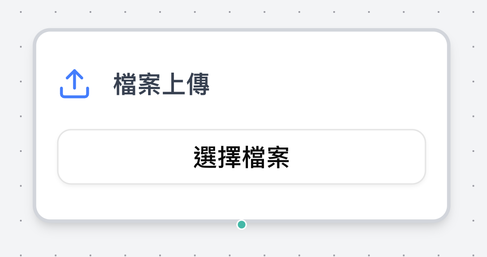
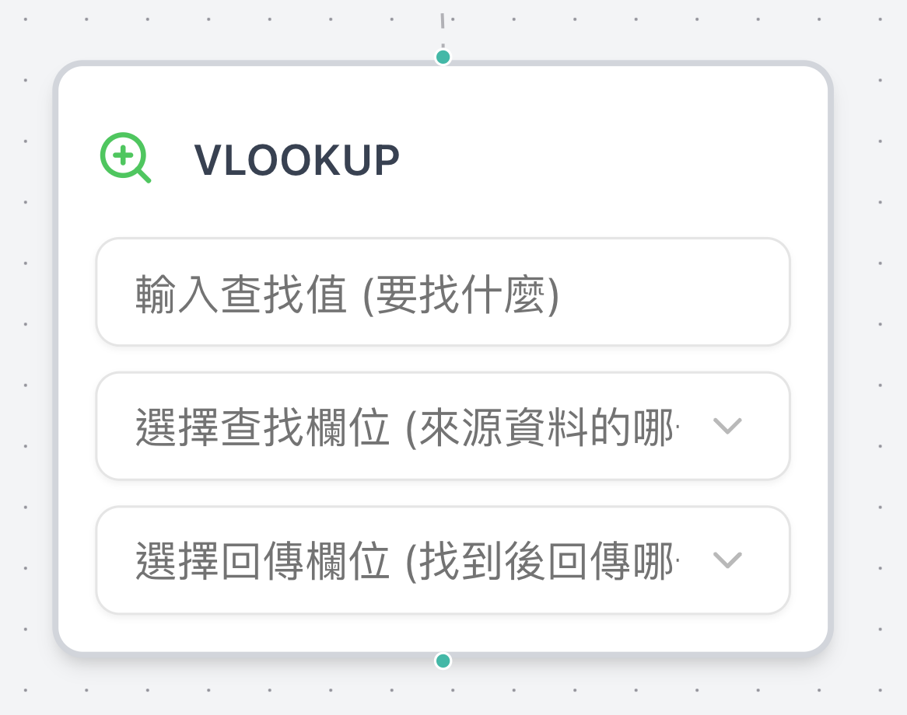
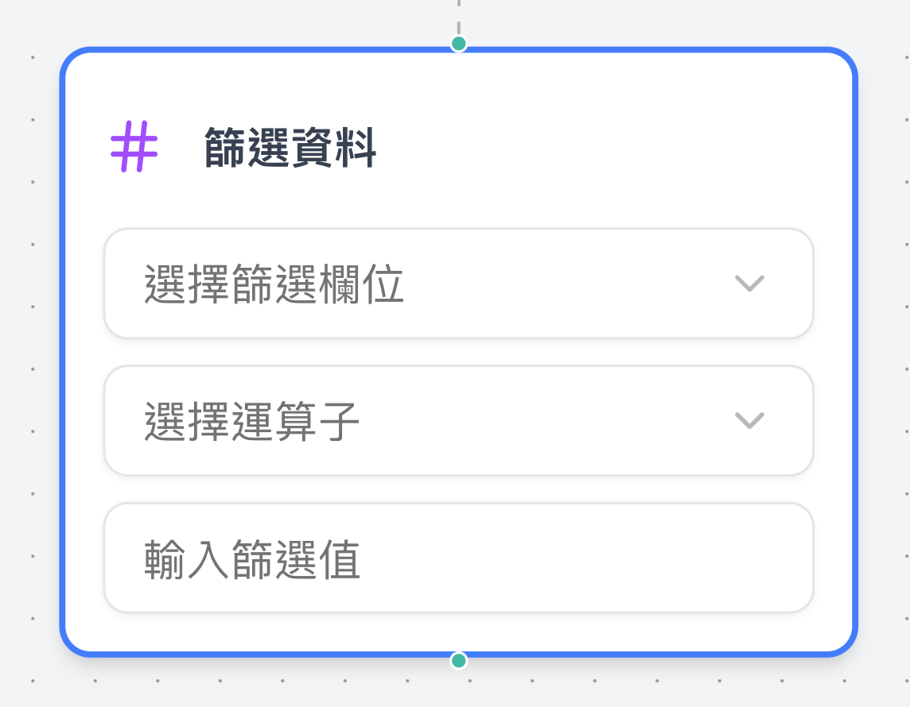
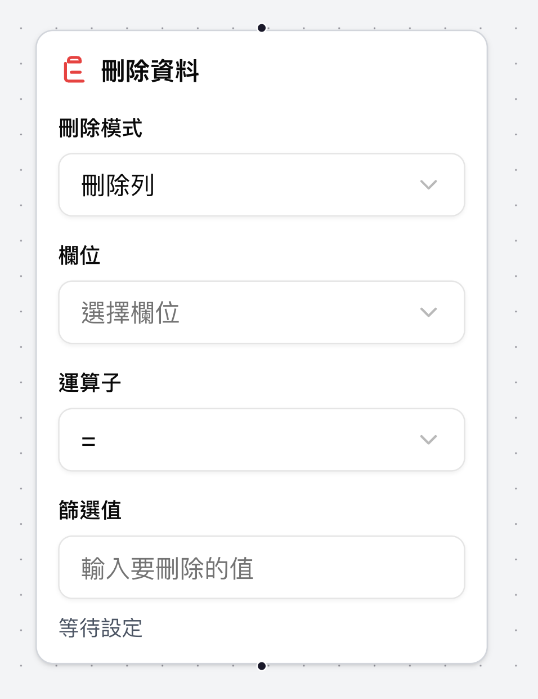
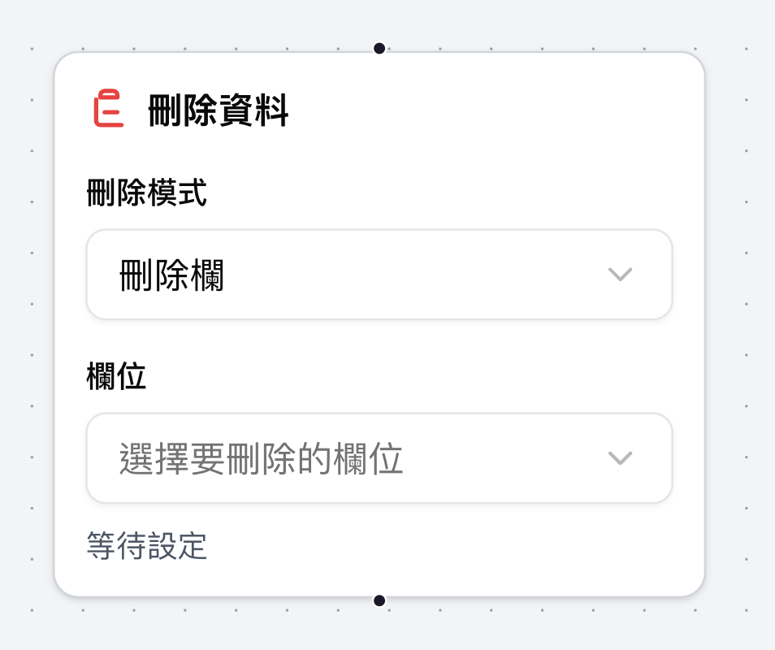
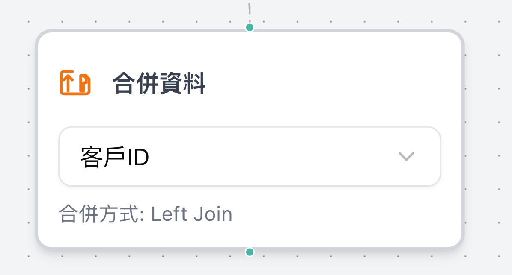
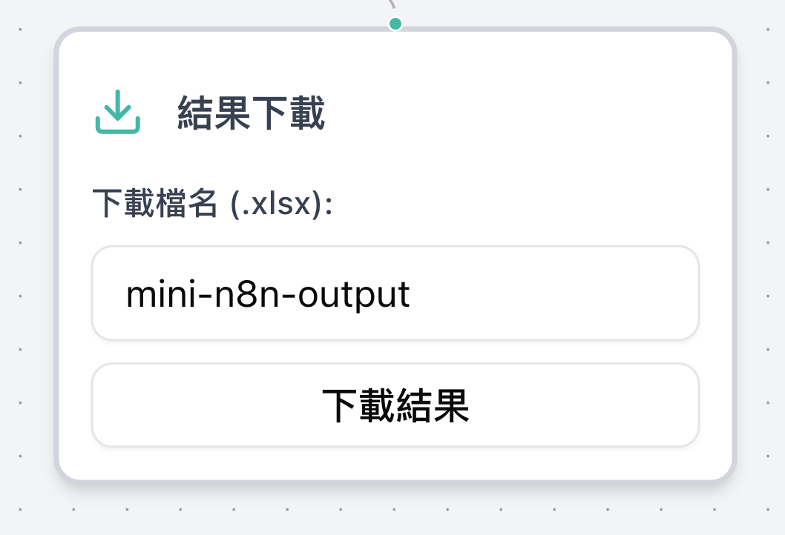
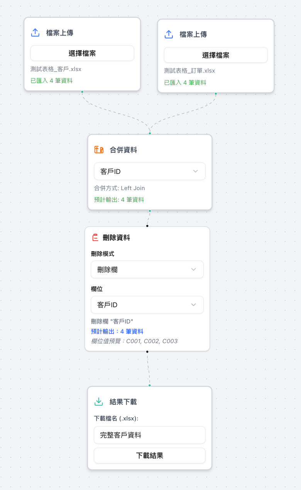

# 🚀 mini-n8n-nextjs

## Docker 部署說明

這是 **mini-n8n-nextjs** 的原始碼專案，只要安裝 Docker，就能直接在本地快速啟動開發伺服器（`npm run dev` 模式），**不需下載 `.tar` 檔案**！

---

## 📦 快速開始（無需打包）

1. 安裝 [Docker](https://www.docker.com/)

2. Clone 本專案：

```bash
git clone https://github.com/YC815/mini-n8n-nextjs.git
cd mini-n8n-nextjs
```

3. 建立 Docker 映像檔：

```bash
docker build -t mini-n8n-nextjs .
```

4. 啟動容器（開發模式使用 3002 port）：

```bash
docker run -d -p 3002:3002 --name mini-n8n-nextjs mini-n8n-nextjs
```

5. 開啟瀏覽器進入：

[http://localhost:3002](http://localhost:3002)

---

## 🛠️ 容器管理指令

| 操作         | 指令                             |
| ------------ | -------------------------------- |
| 停止容器     | `docker stop mini-n8n-nextjs`    |
| 刪除容器     | `docker rm mini-n8n-nextjs`      |
| 刪除映像檔   | `docker rmi mini-n8n-nextjs`     |
| 查看容器 log | `docker logs -f mini-n8n-nextjs` |

---

## 📘 使用說明

- 本專案使用 Next.js，容器內啟動命令為 `npm run dev`。
- 若需修改程式碼，只要本機編輯後重新 `docker build` 即可。
- `.dockerignore` 已排除 `node_modules`，確保映像最小化。

---

## 🧪 測試經驗說明

專案內建測試資料位於：

```
./test_data/
├── balance_data.xlsx
└── userinfo_data.xlsx
```

實測發現：

- 上傳大檔案約需 30 ～ 60 秒。
- 檔案處理與記憶體使用會影響瀏覽器效能，建議限制同時上傳數量。

---

## 📸 功能展示

### 檔案操作



### VLOOKUP 快速查表



### 資料篩選功能



### 資料刪除功能




### 資料合併（Left Join）



### 匯出功能（支援 xlsx）



---

## 🧩 工作流程與介面示範

### 工作流程視圖



### 完整操作介面


> 可儲存佈局並重新載入使用。
